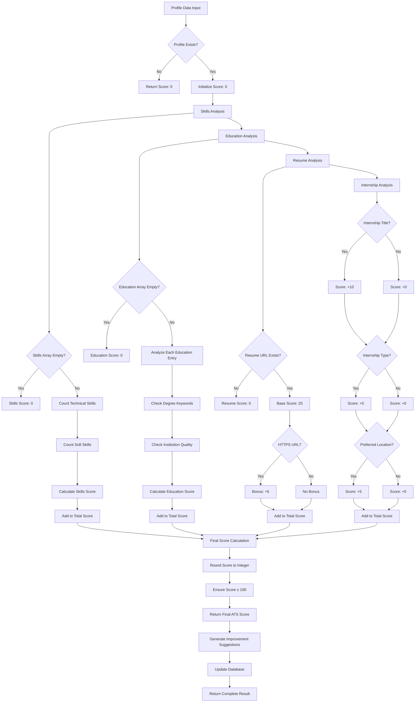
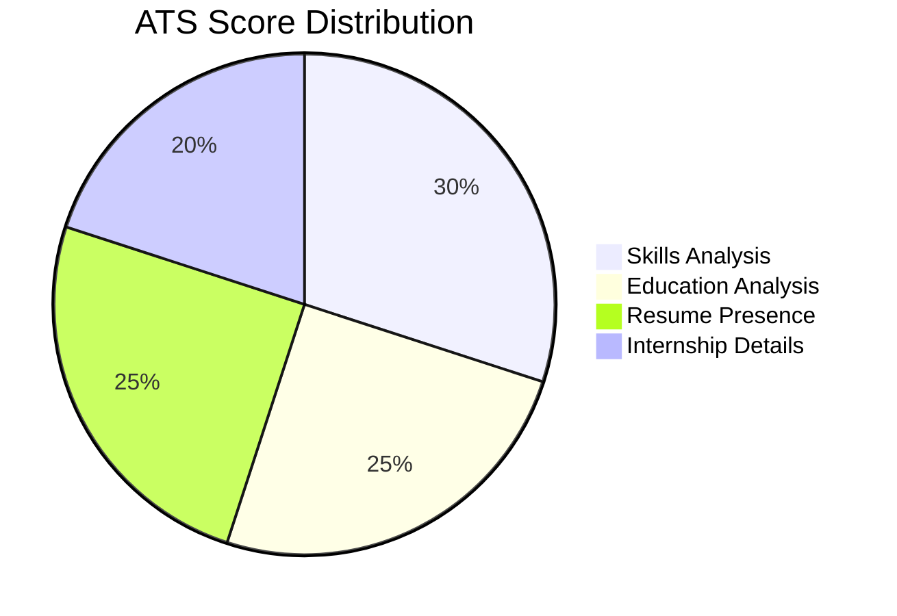
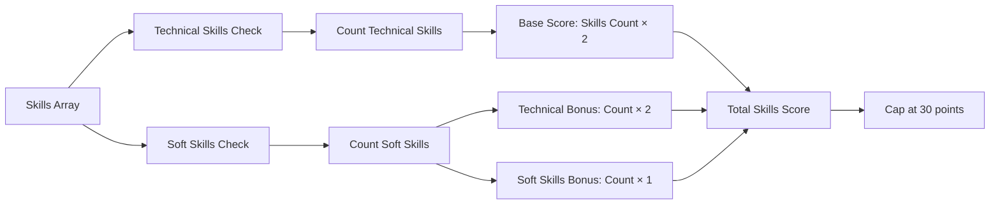
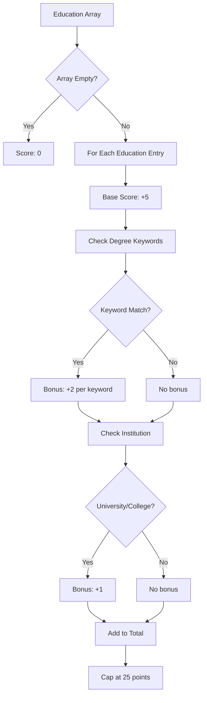
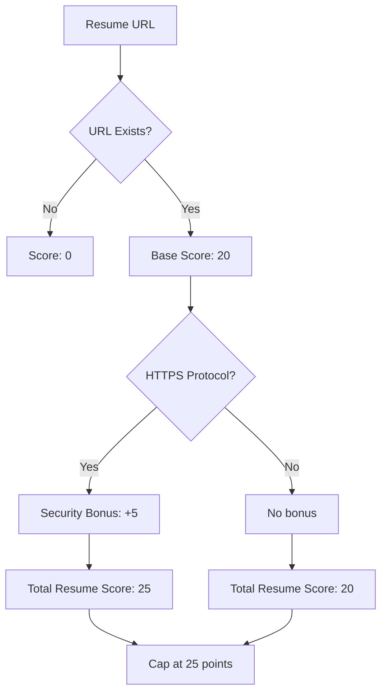
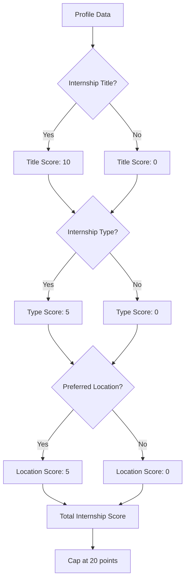
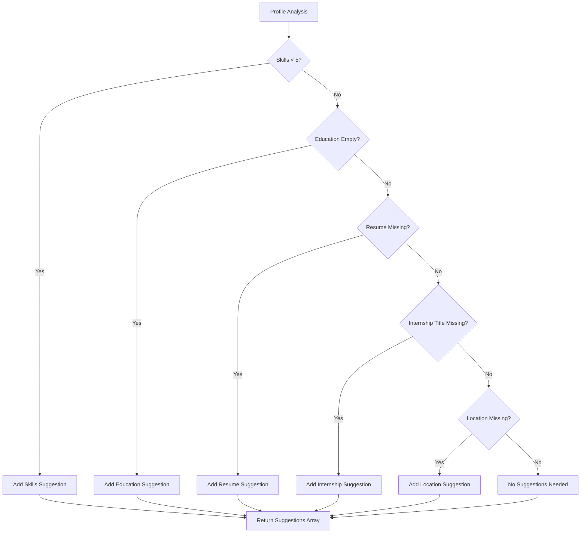
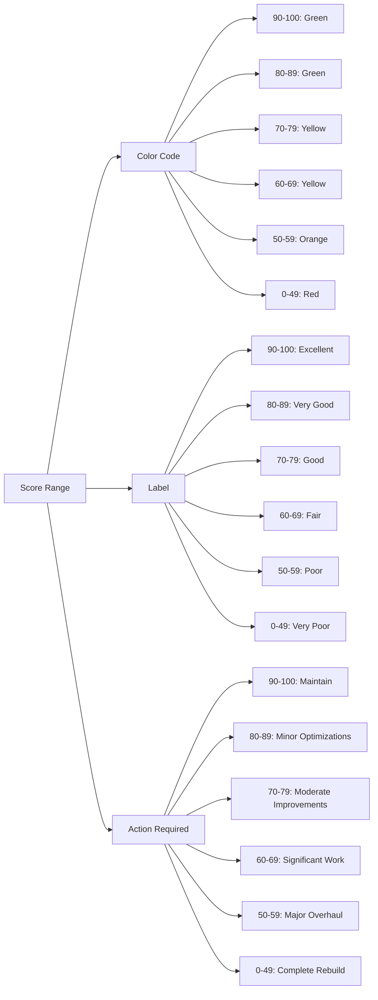
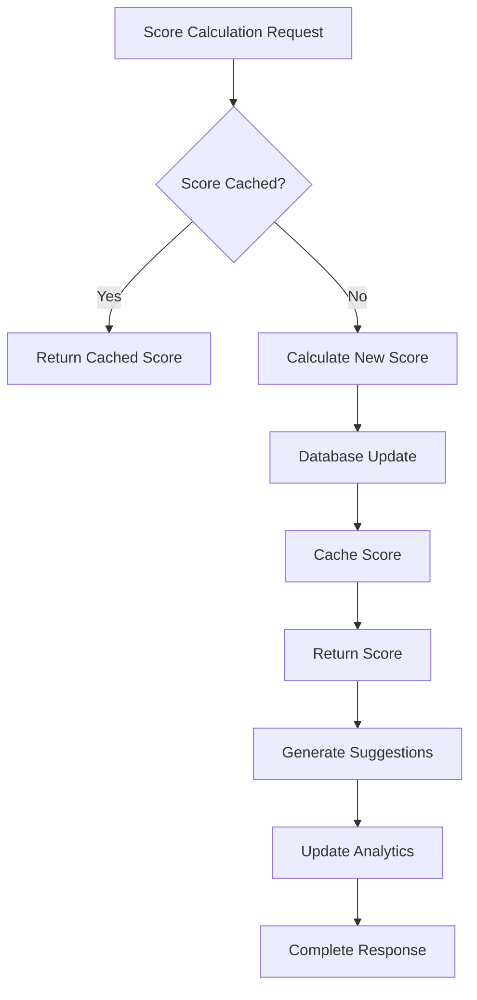

# ATS Scoring Algorithm Flowchart

## 🔄 Algorithm Flow Overview

## 📊 Scoring Component Breakdown

## 🔍 Skills Analysis Sub-Flow

## 🎓 Education Analysis Sub-Flow

## 📄 Resume Analysis Sub-Flow

## 🏢 Internship Analysis Sub-Flow

## 🔧 Suggestion Generation Flow

## 📈 Score Interpretation Matrix

## 🚀 Performance Optimization Flow

This flowchart provides a comprehensive visual representation of how the ATS scoring algorithm processes profile data and generates scores and suggestions for profile optimization.
